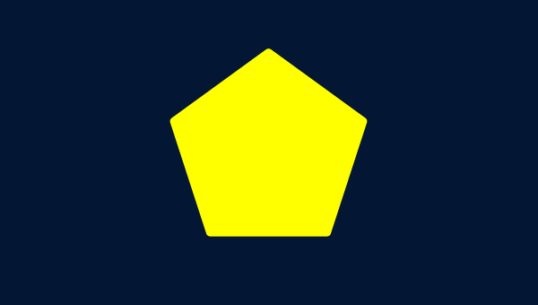
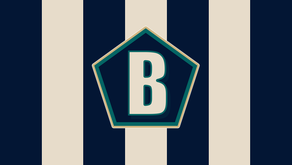

# `generate` - Image Generation

Requires a setup configuration and logos for many features (see [the configuration documentation](readme.md) for more)

```
Usage: pdst generate [OPTIONS] [SOURCE]...

Options:
  -a, --all-colors          Generate separate images using all colors found by
                            analyzing the given image(s). Implies
                            --mode=IMAGE.
  --color TEXT              Generate an image using the given color. Can be
                            passed multiple times to set more than one color
                            (e.g for backgrounds that support multiple
                            colors). Implies --mode=IMAGE
  --invert                  Explicitly enable logo invert mode
  --no-invert               Explicitly disable logo invert mode
  --background, --bg TEXT   Set/override the background setting
  -s, --size INTEGER...     Set the generated image size (width height)
  --mask TEXT                 Draw the logo as a mask of the given color (hex)
  --stroke <INTEGER TEXT>...  Draw a stroke of the given size and color around
                              the logo
  --text TEXT                 Overlay the given text onto the image
  -m, --mode [video|image]  Operation mode (type of files to process)
  -o, --out PATH            Sets the output directory for created files
  -f, --force               Process files that would otherwise be skipped
  -R, --recurse             Recursively traverse directories
  -c, --config PATH         Specify a configuration JSON file
  -v, --verbose             Sets verbosity level
  --help                    Show this message and exit.
```
## Basic Usage

The minimum configuration required for use is to have team logos organized and sports configured in the config file.

For the following examples, we will use the following fake team logos (which can also be found under `tests/test-files/logos/plain`):


In addition, the examples assume a config setup for these logos that matches [this testing config](../tests/test-files/config.json) 
(which sets up a sport named 'Sport' that includes these two teams 'Alpha' and 'Bravo')

If you wish to follow along with the examples, you can run the commands from the `tests/` directory 
and set the config to the above config (you'll need to add this option to set the config: 
`-c test-files/config.json`). Alternatively, you can set the `PDST_CFG` environment variable:

```bash
cd /path/to/pdst/tests

export PDST_CFG=`pwd`/test-files/config.json
```

You will need to be in the `tests/` directory because the test config file uses relative file paths relative 
to that directory.

### Generate thumbnail for a sport match video

The most common use case for automated use of `generate` is to analyze a video filename to try 
and determine which teams are participating in a match, and generate a corresponding 
thumbnail image.

Example:
```
pdst generate -f -o . test-files/testMedia/Sport\ Alpha\ \(2009\)/Season\ 2020/Sport\ Alpha\ \(2009\)\ -\ 2020-08-03\ 08\ 00\ 00\ -\ Team\ Alpha\ vs.\ Team\ Bravo.ts
```

>The `-f` flag is required for this example because there is already a thumbnail alongside the fake 
>video file, so default behavior is to *not* generate a new one. Passing `-f` forces generation anyways.
>
>Likewise, the default output directory when generating a thumbnail for a video is to save the 
>image alongside the file (since that is where Plex looks for it), so by passing `-o .` the 
>generated image will be placed in the current directory, where it will be easier for you to find.

This generates the following image:

%20-%202020-08-03%2008%2000%2000%20-%20Team%20Alpha%20vs.%20Team%20Bravo.png)

The logo files don't have any [hints](#image-generation-filename-hinting) set in their filenames, so the image generator analyzes 
each logo and takes the most common color to use as the background color.

### Generate image for arbitrary teams

Alternatively, once you have a config with sports configured, you can generate match thumbnails for 
arbitrary sport/team combinations using the `teams:` source syntax:

```
pdst generate teams:Sport/Bravo--Sport/Alpha
```


The `teams:` syntax expects 2 Sport + Team designators, following the form: 
`<sport1>/<teamName1>--<sport2/teamName2>`. As a shortcut, if both teams are in the same 'sport', 
you can also use the form: `<sport>/<teamName1>--<teamName2>`.

In the test config, there is a single sport with the name `Sport Alpha`, which will match 
the string `Sport` in the example commands. 

### Generate image for single team

Similar to the `teams:` source syntax, you can generate an image for a single team using the `team:` syntax:

```
pdst generate team:Sport/Alpha
```


## Advanced Options

The basic behavior of the image generation (if there are not [image hints](#image-generation-filename-hinting) in the filename) will place the logo on a solid background of the color that 
is the most common in the logo image. However, this may not be how you want to present the team logo - 
and there are ways to override most aspects of the image generation in single instances, as well 
as provide 'hints' in the logo filename that will set the configuration whenever that logo is used 
to generate an image.


### `--color`

By passing in `--color` one or more times, you can set/override the colors used by the background 
generator. The first color passed will be treated as the primary color, the second color the 
second, etc.

The value passed to `--color` should be a valid RGB hex value (without a leading '#') of one of 
the forms:

* `RGB`
* `RRGGBB`

Examples:

```
pdst generate --color f96900 team:Sport/Alpha
```


```
pdst generate --color 046564 team:Sport/Bravo
```


### `--mask`

By passing in `--mask`, you can set a color overlay to be used on the logo image. 

Similar to `--color`, the value passed to `--mask` should be a valid RGB hex value (without a leading '#') of one of 
the forms:

* `RGB`
* `RRGGBB`

Examples:

```
pdst generate --mask fa4616 team:Sport/Charlie
```


```
pdst generate --mask ff0 team:Sport/Bravo
```


Recall that the default background color is the primary color in the logo, hence the purple/blue backgrounds 
in the above images.

### `--invert` / `--no-invert`

Sometimes, a logo image is all a single color, and instead of placing the color logo on a black/white
background, you want to draw the logo shape as white/black on a color background.

Essentially acts as a shorthand for either `--mask fff` or `--mask 000` based on the lightness of the primary color.

```
pdst generate --invert team:Sport/Charlie
```


If you want to override a filename hint that would normally invert the logo, you can pass `--no-invert`.

### `--stroke`

By passing in `--stroke`, you can specify a stroke to be applied to the logo image. 

`--stroke` expects 2 arguments: a stroke size (in px) and a color (hex code, no leading '#')

Examples:

```
pdst generate --stroke 5 fff team:Sport/Charlie
```


```
pdst generate --stroke 8 008 team:Sport/Alpha
```


### `--text`

If you pass in a string via the `--text` parameter, it will be added to a banner at the bottom 
of the generated image.

Example:

```
pdst generate  --text 'Alpha vs. Bravo' teams:Sport/Alpha--Bravo
```


### Overriding Background Pattern

The default background used for image generation is a solid background of the primary color.

However, there are several alternate background patterns that can be used, and specified on 
the command line by passing in the `--bg` option

#### Stripes - Vertical & Horizontal

There are two striped background pattern types supported: vertical and horizontal, specified by 
`vStripe` and `hStripe` respectively. For each of these patterns you must also specify a stripe
size or count, by appending a number to the stripe type.

The stripes will alternate between the primary and secondary colors in the image, and will be 
equal in size.

If the number is an integer (no decimal point), the generator will draw exactly that many stripes
evenly across the whole image. The stripes will start (at the top or left) with the primary color
and alternate with stripes of the secondary color.

For example, `vStripe7` will draw 7 vertical stripes as the image background:

```
pdst generate --bg vStripe7 team:Sport/Bravo
```


And `hStripe2` will draw 2 horizontal stripes

```
pdst generate --bg hStripe2 team:Sport/Alpha
```


If the number has a decimal point, the generator will draw stripes sized relative to the *size 
of the logo in the image*, using the number as a factor. There will be a stripe of the primary color 
*centered on the logo*. 

In this mode, the number of stripes drawn will vary depending on the size of the image, but the
appearance of the stripes will be more consistent across image sizes and orientations.

For instance, `vStripe1.2` will create stripes 120% the width of the logo, centered on the logo:

```
pdst generate --bg vStripe1.2 team:Sport/Alpha
```


Similarly, `hStripe0.5` will create horizontal stripes 50% of the height of the logo image, 
centered on the logo.

```
pdst generate --bg hStripe0.5 team:Sport/Bravo
```


Note that when specifying a specific *number* of stripes, the stripes start with the primary color.
When specifying stripe *size* as a ratio of the logo size, the stripe centered on the logo will be 
the primary color (and alternating appropriately).

#### Pinstripe

By using the `pinstripe` background style you can generate pinstripe patterns. Similar to the 
equal-sized stripe specifiers, you must include a numeric value to set the spacing between 
the pinstripes. However, for this background pattern any number will be treated as a ratio 
value and set the spacing to an amount relative to the logo size. 

The primary color will be used as the color for the bulk of the background, and the 
pinstripes will be the secondary color.

The pinstripes will be spaced evenly, offset from the center of the logo.

Examples:

```
pdst generate --bg pinstripe0.4 team:Sport/Bravo
```


```
pdst generate --color 3c0050 --color eee --bg pinstripe0.3 --invert team:Sport/Charlie
```


#### Checker

By using the `checker` background style you can generate checkerboard patterns. Similar to 
the stripe backgrounds, you must also supply a numeric value to set the checker square size. 
However, for this background pattern any number will be treated as a ratio value and set the 
square size to a size relative to the logo size. 

For instance, a value of `1` or `1.0` will set the square size to 100% of the smallest of the 
logo dimensions. 

The generated pattern also always centers around the logo, with the center box being the 
primary color.

Examples:

```
pdst generate --bg checker0.3 team:Sport/Bravo
```


```
pdst generate --bg checker1.2 team:Sport/Alpha
```


#### Fill Logo

The `fillLogo` background style attempts to fill the image bounds with the logo, potentially cropping it.

The smaller logo is *not* drawn, and the background behind the larger logo is a solid color.

Example:

```
pdst generate --bg fillLogo team:Sport/Bravo
```


#### Blur + Zoom

The `blurzoom` background style combines the `fillLogo` background with a smaller logo, with the 
background blurred.

```
pdst generate --bg blurzoom team:Sport/Alpha
```


### Combining multiple advanced options

Below are some examples combining multiple advanced options

```
pdst generate --color 3c0050 --color 14b7ed --invert --bg checker0.3 team:Sport/Charlie
```


```
pdst generate --color a1cdc5 --color dfe3cb --bg vStripe0.2 team:Sport/Alpha
```


```
pdst generate --color 036464 --color 031734 --bg hStripe5 team:Sport/Bravo
```


```
pdst generate --color ccc --color 222 --bg hStripe0.8 teams:Sport/Bravo--Sport/Alpha
```


### `-a, --all-colors` Generate example images with every color in logo

Often, you may not know the specific hex color code you want to set as color(s) for a logo, and it is 
useful to see examples of many options so you can choose which one looks best to you.

By setting the `--all-colors` option and passing in a logo, a series of images will be generated,
using each color found in the logo as a different background color. The background color *will 
also be added to the generated image filename*, which is intended to assist with picking a good color
for e.g. color hints

```
pdst generate -a --size 100 100 test-files/logos/plain/Bravo.png
```


```
pdst generate -a --size 100 100 test-files/logos/plain/Alpha.png
```


## Image Generation Filename Hinting

The default behavior for the image generator when using a logo is to try to figure out the most 
common color in the logo and use that as the background color for a solid background behind the logo.

However, this behavior is not always what you want for your images, and the image analysis is also 
time-consuming to be repeated every time an image is generated with a given logo.

You can change the specific behavior of the image generator when using a logo through the use of 
'hints' in the filename. At the moment, the following types of hints are supported:

* [Color(s)](#color-filename-hinting)
* [Background style](#background-filename-hinting)

The way hints work is by appending certain values to the **end** of the logo filename, separated 
from the team name and each other with an underscore (`_`)

For example:
```
Team Alpha_hint1_hint2_hint3.png
```
`hint1`, `hint2`, and `hint3` would be the hints for the image generator (provided they 
followed the appropriate hint syntax as outlined under the specific advanced option above)

### Color filename hinting

To set color hints in the logo filename, just put the hex color codes in the order you want used, 
separated by underscores (`_`).

Ex:

* `Alpha_f96900.png`
* `Bravo_046564.png`
* `Alpha_69d2e6_f96900.png` (this sets a primary and secondary color if more than one color is used, such as 
in a [striped background](#stripes))

To set an `invert` hint, simply add an `i` (case insensitive) to the end of the primary color hint.

Ex:

* `Alpha_f96900i.png`
* `Bravo_046564I.png`
* `Charlie_3c0050i.png`

### Mask hinting

To set a filename hint for a mask color, use the value that you would pass 
to the `--mask` option, prefixed with `mask$`.

Ex:

* `Charlie_mask$fa4616`

### Stroke hinting

To set a filename hint for a stroke (outline), use the values that you would pass 
to the `--stroke` option (size in px and color), prefixed with `stroke$` and separated by a `$`.

Ex:

* `Charlie_stroke$7$fff` - will draw a 7px white outline

### Background filename hinting

To set a filename hint for a particular background pattern, use the value that you would pass 
to the `--bg` option, prefixed with `bg$`.

Ex:

* `Alpha_bg$hStripe3`
* `Bravo_bg$vStripe0.7`
* `Charlie_bg$checker0.5`
