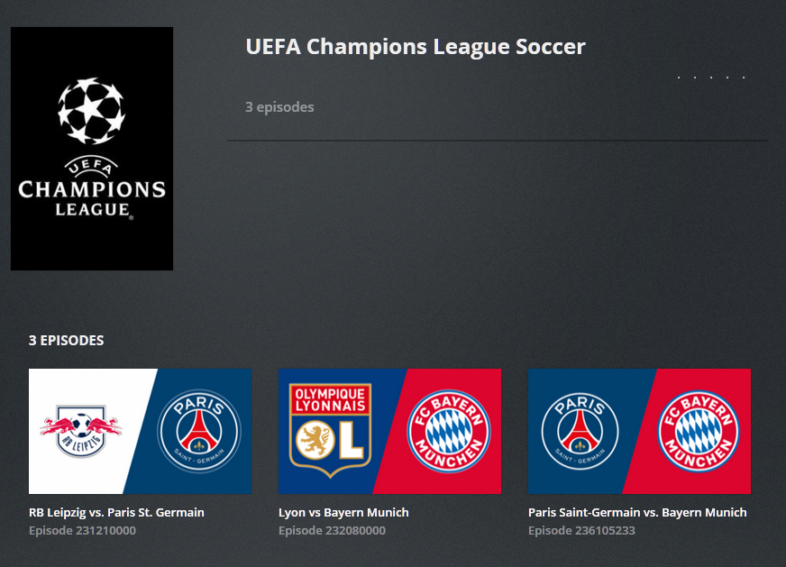

# pdst - DVR & Sports Tools

[](https://gitlab.hulahut.xyz/kevin/pdst/-/commits/master)
[](https://gitlab.hulahut.xyz/kevin/pdst/-/commits/master)

A collections of python tools for Plex library management, primarily focused on improving DVR behavior for sports.



## Motivation

I started using Plex to record sports and was unsatisfied with the basic behavior, so I started writing utility scripts that would solve my problems - eventually I combined many of them into this tool.

### Problem: The default episode thumbnails often contained spoilers

Since sports don't have reference 'artwork' like TV Shows or Movies, the default behavior in Plex for 
thumbnails is to grab a frame from a point in the middle of the video. Of course, this would often contain
spoilers for scores, which was not ideal. I like the interface experience of many streaming services such as 
YouTubeTV or ESPN+ and wanted to recreate that type of artwork for Plex.

#### Solution: [Sport Art Generator](#sports-art-generator)

Generate match thumbnails using team logos - ability to parse out team names from filenames or episode title
and lookup logos to use.

### Problem: DVR EPG data and default file naming often inconsistent/problematic

There are a number of issues I've run into with this, among them:

* Recordings often have bad time component of recording filename
* Default Plex media scanner doesn't distinguish between different events held on the same day
* Inconsistent show names across different channels that I want treated as a single show. For example, I would 
like to have all recordings of the UEFA Champions League matches treated as a single 'show', but depending on the 
channel, the show name might be 'UEFA Champions League', 'UEFA Champions League Soccer', or 'UEFA Champions 
League Fútbol' Not to mention the possibly shifting years included in the show name that would further split 
recordings up.

#### Solution: mjarends Extended Personal Media Shows Agent combined with metadata export and move tools
A combination of [mjarends' Extended Personal Media Shows Agent](https://forums.plex.tv/t/rel-extended-personal-media-shows-agent/44831)
to allow for multiple episodes on the same date (as well as the very useful ability to pull other metadata from an 
external file), and the [metadata export](#metadata-export) and [move](#media-mover) tools to handle all recordings 
of a given sport consistently, and improve file naming.

### Problem: Once 'improved', DVR recordings are 'lost' by the DVR scheduler, leading to duplicated recordings

It seems like if you rename or otherwise move a DVR recording (or use an agent other than the built-in plex one),
Plex DVR has a hard time remembering that you recorde a given event - so if it re-aired you were likely to end up 
with a duplicate recording.

#### Solution: Multi-Library setup

I have had success using a 2-library setup for my sports: 
* The first library just for the raw recordings named 'DVR' that holds the Plex recordings and uses the 
default built-in scanner and agents. This library is hidden from the Home page and searches.
* The second library is named 'Sports' and uses the Extended Personal Media Shows Agent

I have a [watch script](docs/automation.md#watch-dir-and-process) that watches the dvr library and when a recording is added, it:

1. Re-packages the `.ts` file to an `.mkv` for slightly improved file size
2. Exports the Plex DB metadata to a `.metadata` file
3. Generates a thumbnail image
4. Moves the 3 new files (*not the original `.ts`!*) to the Sport library, improving the filename if it can

By leaving the original video file in place, the DVR is able to 'remember' that it has already been recorded and 
doesn't need to be recorded again.

### Problem: Deleting all these extra files

When you delete a video in Plex (For instance, after you've watched a recorde match and want to free up disk space), 
it just deletes the video file, not any other personal media files related to it - such as the 
`.metadata` file or the generated thumbnail image. As a result, over time your library can get cluttered
with all of these 'orphaned' files.

In addition, in my 2-library setup, I only really interact with the Sports library from within Plex - the DVR 
library is just the DVR recording target. It would be a pain to go through and manually delete old recordings 
that I don't need to keep anymore

#### Solution: clean command

Using the [clean](#file-cleanup) command you can scan an entire library and delete 'orphaned' metadata/image files,
or delete any files older than some point.

### Problem: EPG data sometimes is wrong, or I want to be able to easily fix filenames

Sometimes, you may get a recording where the EPG data is wrong, such as when there's a 'Teams TBA' listing. *You* know
what teams are involved, but since that isn't in the metadata, the filename is off, or the air date/time is wrong, 
or whatever.

#### Solution: edit the metadata file, re-run move command
If there is one present, the move command will prioritize data in a `.metadata` file when naming the destination
file. So, in the case above, to fix the game name and date/time, you just need to edit the metadata file 
(specifically `title`, `release`, `releaseTime`) and then re-run the move command. The filenames will then
be updated to reflect the correct title, etc. Then you can easily re-run the thumbnail generation if desired, as well.

### Problem: In multi-game series, it can be difficult to quickly distinguish between matches

In something like the NBA/NHL playoffs where the same two teams play each other multiple times in a row, the 
basic generated thumbnails would all be more or less the same, making it harder than it needs to be to easily
see which game of the series a given game is.

In addition, for something like the Tour de France that just has a generic thumbnail I use for each stage, the 
library quickly looks like a sea of the same image over the 21 stages.

#### Solution: Thumbnail text support

Thankfully, the EPG data frequently contains relatively consistent extra stuff like this in the episode title,
such as `Game 7: This Team vs. That Team` or whatever. You can [configure](docs/readme.md#imagetextregex) the 
thumbnail generation to look for stuff like 'Game #' and add it to the thumbnail.

# Installation

> Note: I run Plex in an Ubuntu server, and as a result all of my testing thus far has been in that environment. 
> This *should* work fine in a Windows environment with python 3 installed, but there may be platform issues 
> I am unaware of that would need to be addressed. If you run into problems, please let me know via the 
> [Plex forums](https://forums.plex.tv/t/release-pdst-dvr-sports-tools/634172)

## Dependencies

Requires Python v3.6+. 

To check your python version, from a command line run `python3 --version`. 

I installed the tools on the same machine that runs Plex, but as long as it has access to the media library
files and the Plex data directory, you *could* install it on a different machine.

## Linux

Installing / ensuring all prerequisites & extra tools I use for e.g. [automation](docs/automation.md)
```
sudo apt update
sudo apt install python3 python3-pip git ffmpeg inotify-tools
```

> You likely want to be `root` to do this (`sudo su -`) to save the code to `/usr/local/src` as well as to 
> install the cli tool for all users. If your regular user also has permissions to all of the plex files, 
> you don't need to do this.

Download this repository to the target machine.

```bash
cd /usr/local/src
git clone https://github.com/Veritas1000/pdst.git
cd pdst/
```

*Alternatively* if you have previously cloned this repo, you can pull the latest version:

```bash
cd /usr/local/src/pdst/
git pull
```

Install the cli tool (run from within `/usr/local/src/pdst/` or wherever you have the code)

```bash
pip3 install .
```

Verify the installation with 

```bash
pdst --version
```

## Windows

TODO: it *should* work the same as linux since it's all python, but I need to verify

## Logos & Config

You will need to get team logos on your own, I have had a lot of luck using Wikipedia since they have high 
quality vector logos for pretty much every team I have looked for. In addition to organizing the logos by 
sport/league, you'll want to name the logos with the team name - for example `Seattle_Seahawks.png`, 
`Boston_Bruins.png`, `Yankees.png`, `Chelsea.png`, etc.

You will also need to [setup your config file](docs/readme.md), feel free to use [the sample config](docs/sample_config.json) as
a starting point to adapt for your needs.

# Tools

## Sports Art Generator

Generates episode thumbnail artwork for sports matches using team logos and optional background styles

```
Usage: pdst generate [OPTIONS] [SOURCE]...
```

[Full Documentation](docs/generate.md)

## Video / Image analysis

Helper tools for setting up image generation.

Given a video file, parse out the team names from the filename, and try to identify the logos that would be 
used to generate the match image.

Given an image/logo file, identify the colors used in the image.

```
Usage: pdst analyze [OPTIONS] PATH...
```

[Full Documentation](docs/analyze.md)

## Metadata Export

Exports Episode metadata from the Plex database in a format recognizable by [mjarends' Extended Personal Media Shows Agent](https://forums.plex.tv/t/rel-extended-personal-media-shows-agent/44831)

Makes it easier to keep DVR EPG data when renaming/moving episodes around

```
Usage: pdst meta-export [OPTIONS] PATH...
```

## Media Mover

Moves associated media between Plex libraries and improves filenames

```
Usage: pdst move [OPTIONS] PATH...
```

[Full Documentation](docs/move.md)

## File Cleanup

Cleans up orphaned files or files older than a given timeframe

```
Usage: pdst clean [OPTIONS] PATH...
```

[Full Documentation](docs/clean.md)


## TODO: Logos Setup Workflow

Future things I need to add instructions/explanations for

Workflow for setting up [image hints](docs/generate.md#image-generation-filename-hinting) from logos

decisions to make (for each logo/team):
1. background style (impacts # of colors to choose)
    1. Background options
1. color(s)

number of decisions create large number of possibilities, likely can't just 
'generate all' and have the user pick the best color like with solid BGs

maybe require a BG choice first? in the docs show examples rather than generate them on the fly
have the user set BG config (other than color) and then generate different color combos?